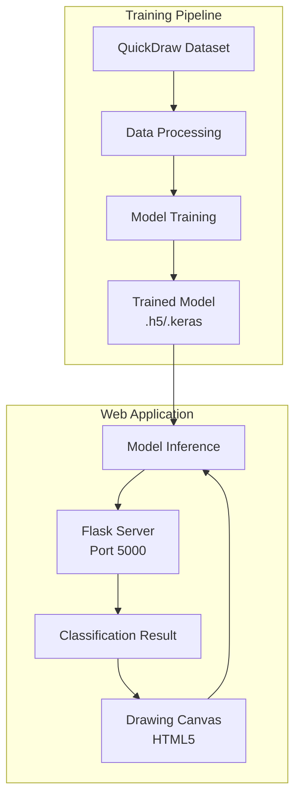
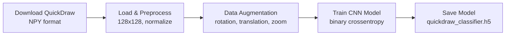
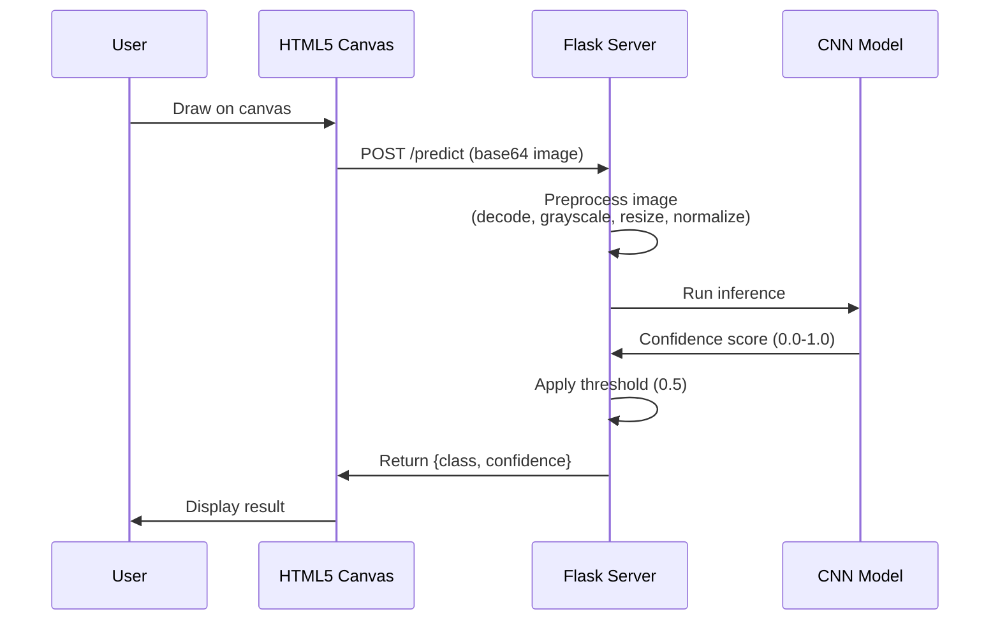
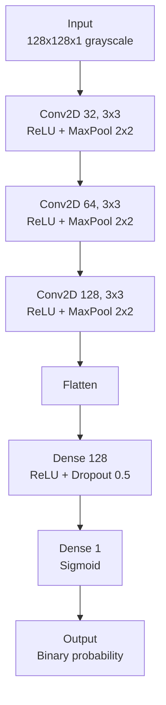
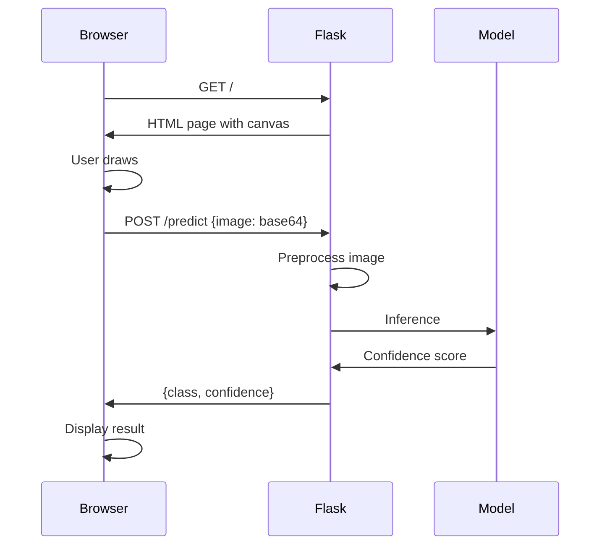

# DoodleHunter System Architecture

**Purpose:** Technical documentation of system design, component interactions, and data flow for DoodleHunter binary classification system.

## Table of Contents

- [Overview](#overview)
- [System Components](#system-components)
- [Data Flow](#data-flow)
- [Model Architecture](#model-architecture)
- [Web Application Architecture](#web-application-architecture)
- [Training Pipeline](#training-pipeline)

## Overview

DoodleHunter uses a modular Python/TensorFlow architecture with three primary components:

1. **Training Pipeline** - Data loading, preprocessing, model training
2. **Flask Web Application** - Real-time drawing classification interface
3. **Model Inference** - CNN-based binary classification

The system prioritizes accuracy and ease of use for content moderation tasks.

**Key Design Decisions:**
- TensorFlow/Keras for ML framework (widely supported, easy deployment)
- Flask for web interface (lightweight, Python-native)
- QuickDraw dataset for training data (large, diverse, free)
- Binary classification (simplifies model and improves accuracy)

## System Components

### Component Overview

| Component | Technology | Responsibility | Location |
|-----------|-----------|----------------|----------|
| **Data Pipeline** | Python + NumPy | Data loading and preprocessing | `src/data/loaders.py`, `src/data/augmentation.py` |
| **Model Training** | TensorFlow/Keras | CNN model training | `scripts/train.py`, `src/core/training.py` |
| **Web Interface** | Flask + HTML5 Canvas | Drawing and classification UI | `src/web/app.py` |
| **Inference Engine** | TensorFlow/Keras | Real-time prediction | `src/core/inference.py` |

### Component Interactions



## Data Flow

### Training Data Flow



### Inference Data Flow



## Model Architecture

### CNN Architecture



**Model Specifications:**
- Input: 128x128 grayscale images
- Output: Single probability value (0.0-1.0)
- Loss: Binary crossentropy
- Optimizer: Adam (lr=0.001)
- Metrics: Accuracy, precision, recall

**Training Configuration:**
```python
model.compile(
    optimizer='adam',
    loss='binary_crossentropy',
    metrics=['accuracy', 'precision', 'recall']
)
```

### Data Preprocessing

**Image Preprocessing Pipeline:**
```python
def preprocess_image(image):
    # 1. Convert to grayscale
    image = image.convert('L')
    
    # 2. Invert colors (canvas has white bg, model expects black bg)
    img_array = 255 - np.array(image)
    
    # 3. Resize to 128x128
    image = Image.fromarray(img_array).resize((128, 128))
    
    # 4. Normalize to [0, 1]
    img_array = np.array(image, dtype=np.float32) / 255.0
    
    # 5. Add batch and channel dimensions
    img_array = np.expand_dims(img_array, axis=(0, -1))
    
    return img_array
```

## Web Application Architecture

### Flask Application Structure

**Directory Layout:**
- `src/web/app.py` - Flask server
- `src/web/templates/index.html` - Drawing interface
- `src/web/static/css/style.css` - Styles
- `src/web/static/js/canvas.js` - Canvas drawing logic

**Flask Routes:**
- `GET /` - Serve drawing interface
- `POST /predict` - Classify drawing
- `GET /health` - Health check

**Request/Response Flow:**



## Training Pipeline

### Training Workflow

**Phase 1: Data Preparation**
```bash
# Download QuickDraw data
python scripts/data_processing/download_quickdraw_ndjson.py
```

**Data Organization:**
- `data/raw_ndjson/` - Downloaded NDJSON files (penis-raw.ndjson, circle-raw.ndjson, etc.)
- `data/processed/` - Processed data and class_mapping.pkl

**Phase 2: Model Training**
```python
# Train model
python scripts/train.py \
  --epochs 50 \
  --batch-size 32 \
  --learning-rate 0.001

# Output: models/quickdraw_classifier.keras
```

**Phase 3: Evaluation**
```python
# Evaluate model
python scripts/evaluate.py \
  --model models/quickdraw_classifier.keras

# Outputs:
# - Accuracy, precision, recall, F1
# - Confusion matrix
# - ROC curve
```

### Data Augmentation

**Augmentation Techniques:**
- Rotation: ±15 degrees
- Translation: ±10% (width/height)
- Zoom: 90-110%
- Horizontal flip: 50% probability

**Implementation:**
```python
# See src/data/augmentation.py for implementation
from src.data.augmentation import create_augmentation_pipeline

datagen = create_augmentation_pipeline(
    rotation_range=15,
    width_shift_range=0.1,
    height_shift_range=0.1,
    zoom_range=0.1,
    horizontal_flip=True
)
```

## Performance Targets

| Metric | Target | Measured At |
|--------|--------|-------------|
| Training accuracy | >90% | Validation set |
| Inference time | <100ms | Single image |
| Model size | <50MB | Saved file |
| Web response time | <200ms | End-to-end |

## Scalability Considerations

**Current Limitations:**
- Single-threaded Flask server
- Model loaded in memory (not optimized for concurrent requests)
- No caching of predictions

**Future Improvements:**
- Use Gunicorn for multi-worker deployment
- Implement model caching and batching
- Add Redis for prediction caching
- Convert to TensorFlow Lite for faster inference
- Deploy on cloud (AWS Lambda, Google Cloud Run)

## Security Architecture

**Input Validation:**
- Validate base64 image format
- Limit image size (<5MB)
- Sanitize file paths
- Prevent path traversal attacks

**Error Handling:**
- Never expose stack traces to client
- Log errors server-side
- Return generic error messages

**Rate Limiting:**
- Limit requests per IP (optional)
- Prevent abuse of prediction endpoint

## Related Documentation

- [API Reference](api.md) - Detailed API documentation
- [Installation](installation.md) - Setup instructions
- [Testing](testing.md) - Testing strategy
- [README](../README.md) - Project overview

*Architecture documentation for DoodleHunter v1.0*
