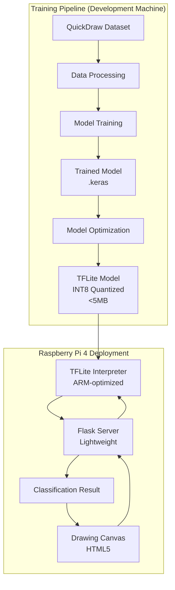
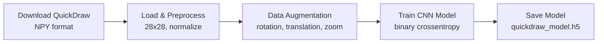
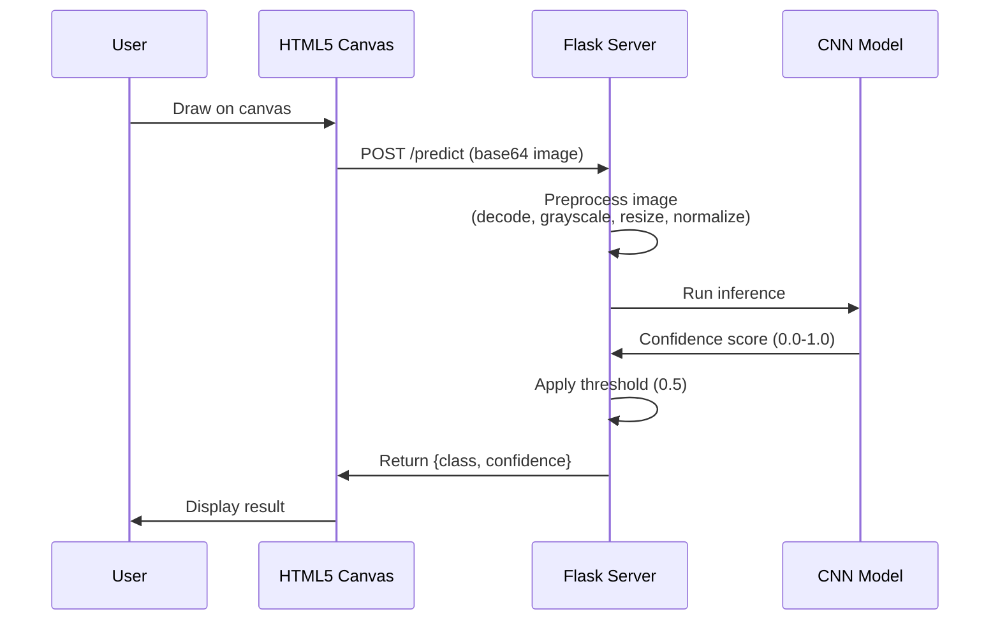
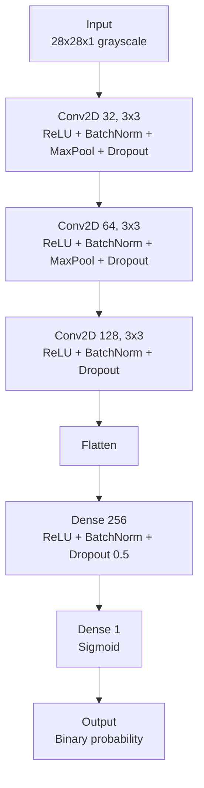
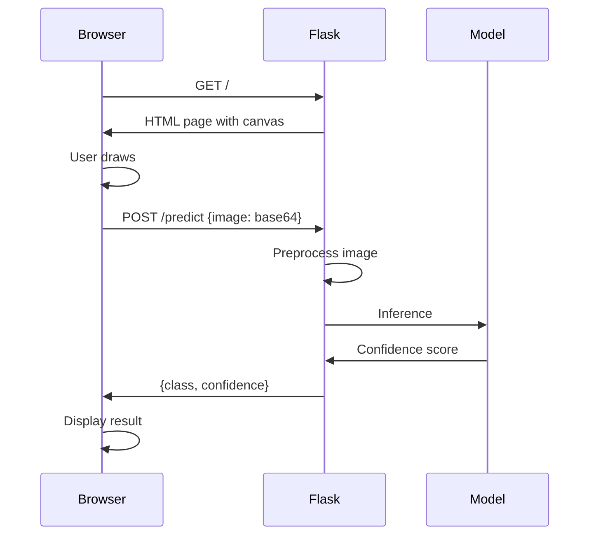

# DoodleHunter System Architecture

**Purpose:** Technical documentation of system design, component interactions, and data flow for DoodleHunter binary classification system.

**Status: Experimental** - This documentation may not fully reflect the current codebase. Last updated to match code: Nov 2024.

## Table of Contents

- [Overview](#overview)
- [System Components](#system-components)
- [Data Flow](#data-flow)
- [Model Architecture](#model-architecture)
- [Web Application Architecture](#web-application-architecture)
- [Training Pipeline](#training-pipeline)
- [Performance Targets](#performance-targets)
- [Raspberry Pi 4 Optimization Strategy](#raspberry-pi-4-optimization-strategy)
- [Scalability Considerations](#scalability-considerations)
- [Security Architecture](#security-architecture)

## Overview

DoodleHunter uses a modular Python/TensorFlow architecture with three primary components:

1. **Training Pipeline** - Data loading, preprocessing, model training
2. **Flask Web Application** - Real-time drawing classification interface
3. **Model Inference** - CNN-based binary classification

The system prioritizes accuracy, performance, and edge device deployment for content moderation tasks.

**Key Design Decisions:**
- TensorFlow/Keras for ML framework (widely supported, easy deployment)
- Flask for web interface (lightweight, Python-native)
- QuickDraw dataset (NumPy bitmap format, pre-processed 28x28 images)
- Binary classification (simplifies model and improves accuracy)
- Multiple CNN architectures available (Custom, ResNet50, MobileNetV3, EfficientNet)
- **Raspberry Pi 4 deployment target** (requires aggressive optimization)

### Deployment Targets

**Primary Target: Raspberry Pi 4**
- **CPU:** ARM Cortex-A72 (4 cores @ 1.5GHz)
- **RAM:** 2GB/4GB/8GB variants (4GB+ recommended)
- **Architecture:** ARMv8 (64-bit)
- **Constraints:** No GPU acceleration, limited memory, thermal throttling
- **Performance Target:** <50ms inference latency per image

### Hardware Requirements for RPi4

**Minimum Configuration:**
- Raspberry Pi 4 Model B (2GB RAM)
- 16GB microSD card (Class 10 or better)
- 5V 3A USB-C power supply
- Passive heatsink

**Recommended Configuration:**
- Raspberry Pi 4 Model B (4GB or 8GB RAM)
- 32GB microSD card (UHS-I A1 or better)
- 5V 3A USB-C power supply with surge protection
- Active cooling (heatsink + 30mm fan)
- Case with ventilation

**Why Active Cooling is Critical:**
- Sustained inference workload generates significant heat
- CPU throttles from 1.5GHz to 1.0GHz at ~80°C
- Performance degradation of 30-40% when throttled
- Active cooling maintains <70°C under load

## System Components

### Component Overview

| Component | Technology | Responsibility | Location |
|-----------|-----------|----------------|----------|
| **Data Pipeline** | Python + NumPy | Data loading and preprocessing | `src/data/loaders.py`, `src/data/augmentation.py` |
| **Model Training** | TensorFlow/Keras | CNN model training | `scripts/train.py`, `src/core/training.py` |
| **Web Interface** | Flask + HTML5 Canvas | Drawing and classification UI | `src/web/app.py` |
| **Inference Engine** | TFLite + NumPy | Real-time prediction (optimized for RPi4) | `src/core/inference.py` |

### Component Interactions



## Data Flow

### Training Data Flow



### Inference Data Flow



## Model Architecture

### CNN Architecture

**Available Architectures:**

The project includes multiple CNN architectures with different complexity/performance trade-offs:

1. **Custom CNN** (423K parameters)


2. **Transfer Learning Models** (larger, higher accuracy)
   - ResNet50: 23.5M parameters
   - MobileNetV3: 5.4M parameters
   - EfficientNet: 5.3M parameters

**Model Specifications (Custom CNN):**
- Input: 28x28 grayscale images
- Output: Single probability value (0.0-1.0)
- Loss: Binary crossentropy
- Optimizer: Adam (lr=0.001)
- Metrics: Accuracy, precision, recall
- Parameters: ~423K (lightweight, fast inference)

**Training Configuration:**
```python
model.compile(
    optimizer='adam',
    loss='binary_crossentropy',
    metrics=['accuracy', 'precision', 'recall']
)
```

### Data Preprocessing

**Image Preprocessing Pipeline:**
```python
def preprocess_image(image):
    # 1. Convert to grayscale
    image = image.convert('L')

    # 2. Invert colors (canvas has white bg, model expects black bg)
    img_array = 255 - np.array(image)

    # 3. Apply morphological dilation to thicken strokes
    # Prevents thin lines from disappearing
    kernel = cv2.getStructuringElement(cv2.MORPH_ELLIPSE, (3, 3))
    img_array = cv2.dilate(img_array, kernel, iterations=1)

    # 4. Resize to 28x28 (model input size)
    image = Image.fromarray(img_array).resize((28, 28))

    # 5. Normalize to [0, 1]
    img_array = np.array(image, dtype=np.float32) / 255.0

    # 6. Apply z-score normalization (only if sufficient variation)
    if img_array.std() > 0.01:
        img_array = (img_array - img_array.mean()) / (img_array.std() + 1e-7)
        img_array = (img_array + 2) / 4  # Rescale to [0, 1]
        img_array = np.clip(img_array, 0, 1)

    # 7. Add batch and channel dimensions
    img_array = np.expand_dims(img_array, axis=(0, -1))

    return img_array
```

## Detection Strategies

DoodleHunter implements three detection modes to address different security and performance requirements:

### Mode 1: Standard Single-Image Classification

**Endpoint:** `POST /api/predict`

**Pipeline:**
```
Canvas (512x512) → Preprocess → Resize to 28x28 → TFLite INT8 Model → Binary Classification
```

**Characteristics:**
- Fastest inference (<30ms on RPi4)
- Simplest implementation
- Vulnerable to content dilution attacks (offensive content mixed with innocent shapes)
- Best for: Quick validation, low-risk scenarios

### Mode 2: Contour-Based Detection (Current Production)

**Endpoint:** `POST /api/predict/region`

**Pipeline:**
```
Canvas → OpenCV findContours(RETR_TREE) → Extract Hierarchical Contours → 
Classify Each Contour → Detect Nested Content → Aggregate Results
```

**Key Features:**
- Isolates individual shapes for independent classification
- Uses `cv2.RETR_TREE` by default for full hierarchical detection
- Detects nested content (e.g., offensive drawing inside a benign circle)
- Filters small contours (noise reduction)
- Supports multiple aggregation strategies: MAX, MEAN, WEIGHTED_MEAN, VOTING, ANY_POSITIVE
- Early stopping on first positive detection
- Typical latency: ~125-135ms for 5-10 contours (including nested analysis)
- Optional `cv2.RETR_EXTERNAL` mode for faster detection (outer boundaries only)

### Mode 3: Tile-Based Detection (Experimental)

**Endpoint:** `POST /api/predict/tile` (planned)

**Pipeline:**
```
Canvas → Fixed Grid (e.g., 8x8 = 64 tiles) → Dirty Tile Tracking → 
Batch Inference → Tile-Level Flagging
```

**Key Features:**
- Divides canvas into fixed-size tiles (configurable: 32x32, 64x64, 128x128)
- Supports non-square canvas dimensions (dynamic grid calculation)
- Dirty tile tracking: only re-analyze tiles affected by new strokes
- Tile caching: cache predictions for unchanged tiles
- Robust against content dilution attacks (each tile analyzed independently)
- Target latency: <200ms for 64 tiles (batched)

**Use Case:** High-security scenarios where users may attempt to hide offensive content by mixing with innocent shapes

## Web Application Architecture

### Flask Application Structure

**Directory Layout:**
- `src/web/app.py` - Flask server with multiple detection modes
- `src/web/templates/index.html` - Drawing interface
- `src/web/static/style.css` - Styles
- `src/web/static/script.js` - Canvas drawing logic

**Flask Routes:**
- `GET /` - Serve drawing interface
- `POST /api/predict` - Standard single-image classification
- `POST /api/predict/region` - Contour-based detection
- `POST /api/predict/tile` - Tile-based detection (experimental)
- `POST /api/tile/reset` - Reset tile detector cache
- `GET /api/health` - Health check with model status

**Request/Response Flow:**



## Training Pipeline

### Training Workflow

**Phase 1: Data Preparation**
```bash
# Download QuickDraw data (NumPy bitmap format, 28x28 pre-processed)
python scripts/data_processing/download_quickdraw_npy.py
```

**Data Organization:**
- `data/raw/` - Downloaded NumPy bitmap files (penis.npy, circle.npy, etc.)
- `data/processed/` - Processed data and class_mapping.pkl
- Format: Pre-processed 28x28 grayscale bitmaps from Google's QuickDraw dataset

**Phase 2: Model Training**
```python
# Train model
python scripts/train.py \
  --epochs 50 \
  --batch-size 32 \
  --learning-rate 0.001

# Output: models/quickdraw_model.h5
```

**Phase 3: Evaluation**
```python
# Evaluate model
python scripts/evaluate.py \
  --model models/quickdraw_model.h5

# Outputs:
# - Accuracy, precision, recall, F1
# - Confusion matrix
# - ROC curve
```

### Data Augmentation

**Augmentation Techniques:**
- Rotation: ±15 degrees
- Translation: ±10% (width/height)
- Zoom: 90-110%
- Horizontal flip: 50% probability

**Implementation:**
```python
# Note: Data augmentation is applied during training
# The QuickDraw dataset is pre-processed (28x28 bitmap format)
# No additional preprocessing needed beyond what's in the dataset
```

**Data Source:**
- Google QuickDraw Dataset (NumPy bitmap format)
- Pre-processed 28x28 grayscale images
- Downloaded from: `https://storage.googleapis.com/quickdraw_dataset/full/numpy_bitmap/`
- Categories: penis (positive) + 21 common shapes (negative)

## Performance Targets

### Development Environment
| Metric | Target | Measured At |
|--------|--------|-------------|
| Training accuracy | >90% | Validation set |
| Inference time | <100ms | Single image (full TF model) |
| Model size | <50MB | Saved .keras file |

### Raspberry Pi 4 Deployment
| Metric | Target | Critical? | Notes |
|--------|--------|-----------|-------|
| **Inference latency** | **<50ms** | **YES** | Single image, TFLite INT8 |
| **Model size** | **<5MB** | **YES** | TFLite quantized model |
| **Memory usage** | **<500MB** | **YES** | Total Python process |
| **Cold start time** | **<3s** | NO | Model loading on startup |
| **Multi-patch inference** | **<200ms** | YES | 9-16 patches batched |
| **CPU utilization** | **<80%** | NO | Per inference, all cores |
| **Accuracy retention** | **>88%** | **YES** | Post-quantization |

## Raspberry Pi 4 Optimization Strategy

### Critical Optimizations for RPi4 Deployment

**1. Model Optimization (MANDATORY)**
- **INT8 Quantization:** Reduce model size by 4x and inference time by 2-4x
- **TensorFlow Lite Conversion:** Use optimized ARM runtime
- **Model Pruning:** Remove redundant weights (target 30-50% sparsity)
- **Architecture Simplification:** Consider reducing layer depth if needed

**2. Inference Optimization**
- **TFLite Interpreter:** Use `tflite_runtime` (lighter than full TensorFlow)
- **XNNPACK Delegate:** Enable ARM NEON SIMD acceleration
- **Thread Pool:** Configure TFLite to use 4 threads (all RPi4 cores)
- **Batch Inference:** Process multiple patches in single forward pass

**3. Memory Management**
- **Lazy Loading:** Load model only when needed
- **Memory Mapping:** Use mmap for model loading
- **Garbage Collection:** Explicit cleanup after inference
- **Swap Configuration:** Disable or minimize swap usage

**4. System-Level Optimizations**
- **CPU Governor:** Set to `performance` mode (avoid throttling)
- **Thermal Management:** Ensure adequate cooling (heatsink + fan)
- **Process Priority:** Run inference with higher priority
- **Minimal OS:** Use Raspberry Pi OS Lite (no desktop environment)

### TensorFlow Lite Conversion Pipeline

```python
# Convert Keras model to TFLite with INT8 quantization
import tensorflow as tf

# Load trained model
model = tf.keras.models.load_model('quickdraw_model.h5')

# Create representative dataset for calibration
def representative_dataset():
    for _ in range(100):
        yield [np.random.rand(1, 128, 128, 1).astype(np.float32)]

# Convert with INT8 quantization
converter = tf.lite.TFLiteConverter.from_keras_model(model)
converter.optimizations = [tf.lite.Optimize.DEFAULT]
converter.representative_dataset = representative_dataset
converter.target_spec.supported_ops = [tf.lite.OpsSet.TFLITE_BUILTINS_INT8]
converter.inference_input_type = tf.uint8
converter.inference_output_type = tf.uint8

tflite_model = converter.convert()

# Save optimized model
with open('quickdraw_model_int8.tflite', 'wb') as f:
    f.write(tflite_model)
```

### RPi4 Inference Implementation

```python
# Optimized inference for Raspberry Pi 4
import numpy as np
import tflite_runtime.interpreter as tflite

class RPi4Inference:
    def __init__(self, model_path):
        # Load TFLite model with optimizations
        self.interpreter = tflite.Interpreter(
            model_path=model_path,
            num_threads=4  # Use all 4 cores
        )
        self.interpreter.allocate_tensors()
        
        # Get input/output details
        self.input_details = self.interpreter.get_input_details()
        self.output_details = self.interpreter.get_output_details()
    
    def predict(self, image):
        # Preprocess to uint8 (matches quantized model)
        input_data = np.array(image, dtype=np.uint8)
        
        # Set input tensor
        self.interpreter.set_tensor(
            self.input_details[0]['index'], 
            input_data
        )
        
        # Run inference
        self.interpreter.invoke()
        
        # Get output
        output = self.interpreter.get_tensor(
            self.output_details[0]['index']
        )
        
        return output[0][0]
```

### Expected Performance on RPi4

| Optimization Stage | Inference Time | Model Size | Accuracy |
|-------------------|----------------|------------|----------|
| Baseline (TF Keras) | ~300-500ms | 45MB | 92% |
| TFLite FP32 | ~150-200ms | 45MB | 92% |
| TFLite INT8 | **~30-50ms** | **<5MB** | ~90% |
| TFLite INT8 + XNNPACK | **~20-40ms** | **<5MB** | ~90% |

### Deployment Checklist for RPi4

**Software Setup:**
- [ ] Install Raspberry Pi OS Lite (64-bit)
- [ ] Update system: `sudo apt update && sudo apt upgrade`
- [ ] Install Python 3.9+ and pip
- [ ] Install `tflite_runtime` (not full TensorFlow)
  ```bash
  pip3 install tflite-runtime
  ```
- [ ] Install minimal dependencies: `numpy`, `flask`, `pillow`
- [ ] Convert model to TFLite INT8 format
- [ ] Copy optimized model to RPi4

**Hardware Setup:**
- [ ] Install heatsink and active cooling fan
- [ ] Verify power supply is 5V 3A minimum
- [ ] Use quality microSD card (UHS-I A1 or better)

**Performance Tuning:**
- [ ] Configure CPU governor to `performance`:
  ```bash
  echo performance | sudo tee /sys/devices/system/cpu/cpu*/cpufreq/scaling_governor
  ```
- [ ] Disable unnecessary system services
- [ ] Disable swap or set swappiness to 10
- [ ] Set process priority for inference

**Validation:**
- [ ] Benchmark inference latency on actual hardware
- [ ] Verify accuracy retention (>88% required)
- [ ] Test under sustained load (thermal throttling check)
- [ ] Monitor CPU temperature (should stay <75°C)
- [ ] Monitor memory usage (<500MB target)
- [ ] Test multi-patch inference performance

## Scalability Considerations

### Raspberry Pi 4 Constraints
- **Single Device Limitation:** RPi4 not suitable for high-concurrency scenarios
- **Thermal Throttling:** Sustained load may cause CPU frequency reduction
- **Memory Constraints:** Limited to 2-8GB RAM
- **No GPU Acceleration:** CPU-only inference

### Multi-Device Scaling (Future)
- Deploy multiple RPi4 units with load balancer
- Use edge computing architecture (distributed inference)
- Consider RPi5 or Jetson Nano for better performance
- Implement request queuing for burst traffic

## Security Architecture

**Input Validation:**
- Validate base64 image format
- Limit image size (<5MB)
- Sanitize file paths
- Prevent path traversal attacks

**Error Handling:**
- Never expose stack traces to client
- Log errors server-side
- Return generic error messages

**Rate Limiting:**
- Limit requests per IP (optional)
- Prevent abuse of prediction endpoint

## Related Documentation

- [API Reference](api.md) - Detailed API documentation
- [Installation](installation.md) - Setup instructions
- [Testing](testing.md) - Testing strategy
- [README](../README.md) - Project overview

*Architecture documentation for DoodleHunter v1.0*
