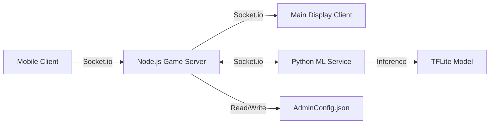

# Architecture Overview

DoodleParty implements a real-time event-driven architecture using Socket.io.

## High-Level Design

```mermaid
graph LR
    Sender[Mobile Client] --> |Socket.io| Server[Node.js Game Server]
    Server --> |Socket.io| Viewer[Main Display Client]
    Server <--> |Socket.io| ML[Python ML Service]
    Server --> |Read/Write| Config[AdminConfig.json]
    ML --> |Inference| Model[TFLite Model]
```

## Components

### 1. Game Server (Node.js)
*   **Role**: Central relay for drawing strokes and state.
*   **Tech Stack**: Express, Socket.io, Vite.
*   **Responsibilities**:
    *   Serving assets: `doodleparty.html` (Sender) and `index.html` (Viewer).
    *   Broadcasting strokes from Senders to Viewer and other Senders.
    *   Managing shared state (Timer, Player Count).
    *   Relaying detection requests to ML Service.

### 2. ML Service (Python)
*   **Role**: Content moderation (NSFW detection).
*   **Tech Stack**: Python, Socket.io Client, TensorFlow Lite.
*   **Responsibilities**:
    *   Connects as a client.
    *   Receives image payloads via `ml.detectObjects`.
    *   Runs inference (Binary Classification: Safe vs NSFW).
    *   Returns results via `ml.detectionResults`.

## Data Flow

1.  **Drawing**: User draws on **Sender**. Strokes emitted as `quickdraw.stroke`.
2.  **Broadcast**: Server relays strokes to **Viewer** (for display) and other Senders.
3.  **Detection**: Client snapshots canvas and emits `ml.detectObjects`.
4.  **Inference**: ML Service processes image, detects prohibited content.
5.  **Action**: If positive, ML Service reports back. Client/Server triggers `quickdraw.eraseRegion` to censor the content.
