# DoodleParty System Architecture

**Purpose:** Technical documentation of system design, component interactions, and data flow for DoodleParty collaborative drawing platform.

**Status: Production Ready** - Comprehensive architecture for real-time collaboration and AI-powered moderation.

## Table of Contents

### System Overview
- [Overview](#overview)
  - [Deployment Targets](#deployment-targets)
  - [Key Design Decisions](#key-design-decisions)
- [System Components](#system-components)
  - [Component Overview](#component-overview)
  - [Component Interactions](#component-interactions)

### Deployment Architectures
- [Deployment Architectures](#deployment-architectures)
  - [Architecture 1: Raspberry Pi 4 (On-Premises)](#architecture-1-raspberry-pi-4-on-premises)
    - [Network Configuration](#network-configuration)
    - [Advantages](#advantages)
  - [Architecture 2: DigitalOcean Cloud](#architecture-2-digitalocean-cloud)
    - [Scaling](#scaling)
    - [Advantages](#advantages-1)

### System Design
- [Data Flow](#data-flow)
  - [Real-Time Drawing Flow](#real-time-drawing-flow)
  - [Game Mode Flow (Speed Sketch Example)](#game-mode-flow-speed-sketch-example)
- [Real-Time Communication](#real-time-communication)
  - [WebSocket Events](#websocket-events)
    - [Client → Server Events](#client--server-events)
    - [Server → Client Events](#server--client-events)
  - [Message Rate Limiting](#message-rate-limiting)

### Implementation Details
- [Content Moderation Pipeline](#content-moderation-pipeline)
  - [ML Model Architecture](#ml-model-architecture)
  - [Detection Strategies](#detection-strategies)
    - [Shape-Based Detection](#shape-based-detection)
    - [Tile-Based Detection](#tile-based-detection)
    - [Region-Based Detection](#region-based-detection)
  - [Moderation Workflow](#moderation-workflow)

- [Game Modes Architecture](#game-modes-architecture)
  - [Classic Canvas](#classic-canvas)
  - [Speed Sketch Challenge](#speed-sketch-challenge)
  - [Guess The Doodle](#guess-the-doodle)
  - [Battle Royale Doodle](#battle-royale-doodle)
  - [Collaborative Story Canvas](#collaborative-story-canvas)

### Performance & Scalability
- [Performance Targets](#performance-targets)
  - [Development Environment](#development-environment)
- [Scalability Considerations](#scalability-considerations)
  - [Raspberry Pi 4 Constraints](#raspberry-pi-4-constraints)
  - [Cloud Scaling Strategy](#cloud-scaling-strategy)

### Security
- [Security Architecture](#security-architecture)
  - [Input Validation](#input-validation)
  - [Content Security](#content-security)
  - [Network Security](#network-security)
  - [Data Privacy](#data-privacy)

### Documentation Resources
- [Related Documentation](#related-documentation)
  - [Implementation](#implementation)
  - [Operations](#operations)
  - [Development](#development)

## Related Documentation

### Implementation
- [API Reference](api.md) - Complete WebSocket and REST API documentation
- [ML Pipeline](ml-pipeline.md) - Content moderation implementation details
- [Project Structure](structure.md) - Code organization and file layout

### Operations
- [Installation Guide](installation.md) - Setup instructions for RPi4 and cloud
- [Nix Usage Guide](nix-usage.md) - NixOS-specific deployment

### Development
- [Testing Strategy](testing.md) - Testing approach and implementation
- [Code Style Guide](../STYLE_GUIDE.md) - Development standards and conventions
- [Development Roadmap](roadmap.md) - Future plans and features

## Overview

DoodleParty uses a modular architecture with three primary deployment targets:

1. **Raspberry Pi 4 (On-Premises)** - Self-contained hardware for events
2. **DigitalOcean Cloud** - Managed SaaS with auto-scaling
3. **Hybrid** - Local RPi4 with cloud backup and analytics

**Key Design Decisions:**
- Node.js + Express for real-time WebSocket server
- React for responsive web/mobile UI
- TensorFlow Lite for edge ML inference (RPi4)
- Socket.io for real-time synchronization
- Custom TFLite binary classifier for content moderation
- DigitalOcean AI for LLM features (prompts, narration)
- PostgreSQL for persistent data
- Redis for real-time state management

*For installation steps, see the [Installation Guide](installation.md).*

## System Components

### Component Overview

| Component | Technology | Responsibility | Location | Deployment |
|-----------|-----------|---------------------------|----------|-------------|
| **Web Server** | Node.js + Express | HTTP routing, static assets, request handling | Port 3000 | RPi4 / Cloud |
| **Real-Time Engine** | Socket.io | WebSocket connections, canvas sync, event broadcasting | Port 3000 | RPi4 / Cloud |
| **ML Inference** | TensorFlow Lite | Content moderation, shape classification, confidence scoring | Port 5001 (RPi4) | RPi4 only |
| **Frontend** | React + TypeScript | Drawing UI, game modes, real-time canvas rendering | Browser | All |
| **Database** | PostgreSQL | User data, game history, leaderboards, analytics | Managed service | Cloud only |
| **Cache** | Redis | Real-time state, session management, leaderboard caching | Managed service | Cloud only |
| **LLM Integration** | DigitalOcean AI | Prompt generation, narration, creative content | API calls | Cloud only |

### Component Interactions

## Deployment Architectures

### Architecture 1: Raspberry Pi 4 (On-Premises)

**Ideal for:** Events, conferences, festivals with local network

**Network Configuration:**
- Router: 192.168.1.1
- RPi4: 192.168.1.10 (static IP)
- User devices: 192.168.1.50-200 (DHCP)
- Isolated from event WiFi for reliability

**Advantages:**
- Complete offline operation
- No internet required
- Data privacy (all local)
- Predictable performance
- No cloud costs

### Architecture 2: DigitalOcean Cloud

**Ideal for:** Large-scale events, SaaS offering, global access

**Scaling:**
- Auto-scale Node.js pods: 2-20 replicas
- Auto-scale GPU instances: 1-5 instances
- Load balancing across all pods
- Redis cluster for distributed caching

**Advantages:**
- Unlimited scalability
- Full AI features (LLM)
- Managed infrastructure
- Global CDN for assets
- Automatic backups

## Data Flow

### Real-Time Drawing Flow

### Game Mode Flow (Speed Sketch Example)

## Real-Time Communication

### WebSocket Events

**Client → Server:**
- `stroke` - Drawing stroke data
- `vote` - Game mode voting
- `chat` - Text message (if enabled)
- `timer-ready` - Player ready for next round
- `disconnect` - User leaving

**Server → Client:**
- `stroke` - Broadcast stroke to all users
- `canvas-update` - Full canvas state update
- `moderation-alert` - Content flagged/removed
- `prompt` - New game mode prompt
- `timer-tick` - Countdown update
- `results` - Game round results
- `leaderboard-update` - Score changes

### Message Rate Limiting

**Per-User Limits:**
- Max 100 drawing points per second
- Max 1 vote per 500ms
- Max 1 chat message per 1000ms

**Detection:**
- Temporal validation (detects bot patterns)
- Server-side rate limiting
- Automatic disconnect on abuse

### Content Moderation Pipeline

### ML Model Architecture

**Framework:** TensorFlow/Keras with TFLite optimization
**Base Model:** Custom CNN (423K parameters) or transfer learning
**Input:** 28x28 grayscale images (QuickDraw dataset format)
**Output:** Binary probability (0.0-1.0)

*For detailed implementation, see the [ML Pipeline documentation](ml-pipeline.md) which covers the preprocessing steps, detection strategies, and Raspberry Pi 4 optimization in greater depth.*

### Detection Strategies

**1. Shape-Based Detection**
- Stroke-aware shape extraction
- Cluster strokes by proximity/timing
- Per-shape classification
- Grouping logic for multi-part objects
- Penis-specific heuristic (shaft + two balls pattern)
- Latency: ~95ms with stroke awareness

**2. Tile-Based Detection**
- Fixed grid partitioning (8x8 for 512x512 canvas)
- Dirty tile tracking for incremental updates
- Per-tile inference
- Tile caching for unchanged regions
- Robust against content dilution attacks
- Latency: <200ms for 64 tiles

**3. Region-Based Detection**
- OpenCV contour extraction (RETR_TREE)
- Hierarchical detection for nested content
- Individual contour classification
- Aggregation strategies (MAX, MEAN, VOTING)
- Latency: ~125ms for 5-10 contours

### Moderation Workflow

```mermaid
graph TD
    A["Canvas Stroke"]
    B["Extract Region<br/>(Shape/Tile/Contour)"]
    C["Preprocess Image"]
    C1["Convert to grayscale"]
    C2["Invert colors"]
    C3["Morphological dilation"]
    C4["Resize to 28x28"]
    C5["Normalize to [0, 1]"]
    C6["Z-score normalization"]
    D["TFLite Inference"]
    D1["Binary classification"]
    D2["Confidence score<br/>(0.0-1.0)"]
    E["Apply Threshold<br/>(≥0.50)"]
    F["Approved:<br/>Broadcast stroke"]
    G["Rejected:<br/>Remove stroke,<br/>notify user"]
    H["Update Canvas State"]
    
    A --> B
    B --> C
    C --> C1
    C --> C2
    C --> C3
    C --> C4
    C --> C5
    C --> C6
    C1 --> D
    C2 --> D
    C3 --> D
    C4 --> D
    C5 --> D
    C6 --> D
    D --> D1
    D --> D2
    D1 --> E
    D2 --> E
    E -->|Approved| F
    E -->|Rejected| G
    F --> H
    G --> H
    
    style A fill:#e1f5ff
    style B fill:#fff3e0
    style C fill:#f3e5f5
    style D fill:#f3e5f5
    style E fill:#fff9c4
    style F fill:#c8e6c9
    style G fill:#ffcdd2
    style H fill:#e1f5ff
```

### Performance Targets

| Metric | Target | Critical? | Rationale |
|-----------|--------|-----------|----------------------------------------|
| Inference latency | <50ms | Critical | Per-stroke ML classification must be fast |
| Model size | <5MB | Critical | Must fit in RPi4 memory constraints |
| Memory usage | <500MB | Critical | Total system memory for ML pipeline |
| Accuracy retention | >88% | Critical | Maintain model accuracy after TFLite conversion |
| Multi-patch inference | <200ms | Critical | Batch processing for multiple regions |

## Game Modes Architecture

### 1. Classic Canvas

**Flow:**
- Free-form collaborative drawing
- Real-time moderation
- Configurable timer (30s - 1hr)
- Ink depletion system
- No scoring

**Use Case:** Event lobbies, social spaces

### 2. Speed Sketch Challenge

**Flow:**
- Server generates prompt (LLM)
- Players draw for 30 seconds
- Community votes on best interpretation
- Points awarded to winner
- Leaderboard updated

**Components:**
- Prompt generation service
- Voting aggregation
- Leaderboard management

### 3. Guess The Doodle

**Flow:**
- One player draws
- Others guess in real-time
- Points for speed and accuracy
- Projector shows leaderboard
- Multiple rounds

**Components:**
- Drawing player selection
- Guess validation
- Scoring algorithm

### 4. Battle Royale Doodle

**Flow:**
- Elimination-style competition
- Progressive difficulty
- Audience votes remove slowest drawers
- Last artist standing wins

**Components:**
- Player elimination logic
- Difficulty scaling
- Audience voting aggregation

### 5. Collaborative Story Canvas

**Flow:**
- Divided canvas sections
- Sequential reveals
- Each user adds next panel
- Theme-based prompts
- Emergent narratives

**Components:**
- Canvas section management
- Sequential unlock logic
- Story progression tracking

### Performance Targets

### Development Environment

| Metric | Target | Notes |
|-----------|--------|-------------------------------------|
| Training accuracy | >90% | Full-precision model on GPU |
| Inference time | <100ms | Pre-quantization baseline |
| Model size | <50MB | Full model before TFLite conversion |

*For production targets and benchmarks, see the [ML Pipeline documentation](ml-pipeline.md#performance-targets) and [Testing Strategy](testing.md#performance-testing).*

## Scalability Considerations

### Raspberry Pi 4 Constraints

**Memory Budget (4GB RAM):**
- Node.js server: 256-512MB (with `--max-old-space-size=512`)
- ML inference service: 300-500MB (TFLite INT8 model + buffers)
- Operating system: 500-800MB
- Available for users: ~1.5-2GB (supports ~100 concurrent users)
- Per-user memory: ~15-20MB (includes WebSocket connection, canvas state)

**Optimization Requirements:**
- Disable Bluetooth, Avahi, HDMI (saves ~25MB)
- Use INT8 TFLite model (5MB, not 50MB Keras)
- Enable garbage collection (60s interval)
- Implement connection pooling and limits
- Batch WebSocket messages (50ms intervals)

**Performance Constraints:**
- Single Device Limitation: RPi4 supports ~100 concurrent users
- Thermal Throttling: Sustained load may cause CPU frequency reduction (mitigate with active cooling)
- No GPU Acceleration: CPU-only inference (use XNNPACK delegate for SIMD)
- Inference Latency: <50ms per stroke (INT8 quantization critical)
- Model Size: <5MB (INT8 quantization mandatory)

### Cloud Scaling Strategy

- **Horizontal Scaling:** Add more Node.js pods
- **GPU Scaling:** Add GPU instances for ML inference
- **Database Scaling:** Read replicas for analytics
- **Cache Scaling:** Redis cluster for distributed state
- **Load Balancing:** Distribute traffic across pods

## Security Architecture

### Input Validation

- Validate all WebSocket messages
- Limit payload sizes
- Sanitize user input
- Prevent path traversal attacks
- Rate limiting per user

### Content Security

- Paste event blocking (prevents image pasting)
- Temporal validation (detects bot patterns)
- Server-side validation of all strokes
- No external dependencies for core functionality

### Network Security

- HTTPS for cloud deployments
- Local network isolation for RPi4
- WebSocket secure (WSS) for cloud
- Authentication tokens for API access

### Data Privacy

- RPi4 deployment: All data stays local
- Cloud deployment: Encrypted at rest and in transit
- GDPR compliance for EU users
- Data retention policies

## Further Reading

### For Implementers
- [API Reference](api.md) - Complete WebSocket and REST API protocol
- [ML Pipeline](ml-pipeline.md) - Detailed content moderation implementation
- [Project Structure](structure.md) - Code organization and file layout

### For Operators
- [Installation Guide](installation.md) - Complete setup for RPi4 and cloud deployment
- [Nix Usage Guide](nix-usage.md) - NixOS-specific deployment instructions
- [Troubleshooting](troubleshooting.md) - System issues and solutions

### For Developers
- [Testing Strategy](testing.md) - Component testing and integration testing
- [Code Style Guide](../STYLE_GUIDE.md) - Development standards and conventions
- [Development Roadmap](roadmap.md) - Current status and future features

*Architecture documentation for DoodleParty v1.0*
