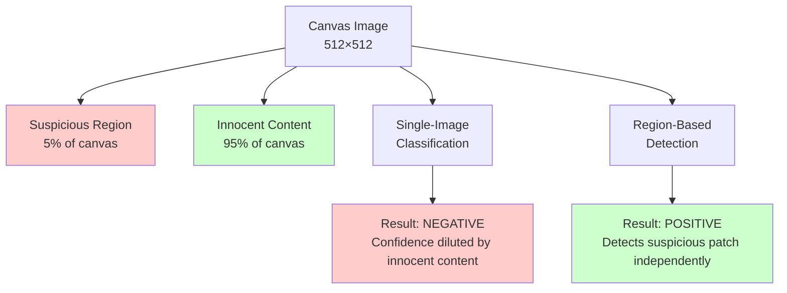
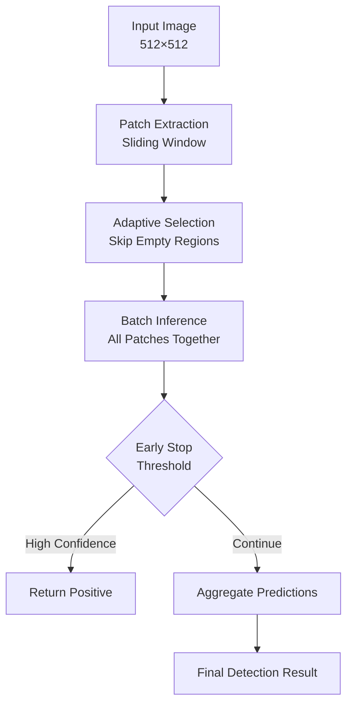

# Region-Based Detection for Robustness

**Purpose:** Technical documentation for the region-based detection system that prevents content dilution attacks and improves classification robustness.

## Table of Contents

- [Overview](#overview)
- [Motivation](#motivation)
- [Architecture](#architecture)
- [Key Components](#key-components)
- [Usage Examples](#usage-examples)
- [Performance Considerations](#performance-considerations)
- [Best Practices](#best-practices)

## Overview

Region-based detection analyzes multiple patches of a canvas independently using a sliding window approach. This prevents attackers from evading detection by mixing inappropriate content with innocent content (content dilution attacks).

**Key Benefits:**
- **Robustness:** Detects suspicious content even when diluted across the image
- **Efficiency:** Adaptive patch selection skips empty regions
- **Performance:** Batch inference processes all patches in a single forward pass
- **Flexibility:** Multiple aggregation strategies for different use cases

## Motivation

### The Content Dilution Attack

Traditional single-image classification can be fooled by content dilution:



### Why Patch-Based Detection?

1. **Local Analysis:** Each patch is analyzed independently
2. **Context Preservation:** Small regions maintain their original confidence
3. **Robustness:** Cannot be fooled by adding innocent content
4. **Early Detection:** Can stop on first positive detection

## Architecture



### Pipeline Stages

1. **Patch Extraction:** Sliding window extracts overlapping or non-overlapping patches
2. **Adaptive Selection:** Filters patches by content ratio (skips empty regions)
3. **Batch Inference:** Processes all patches in a single forward pass
4. **Early Stopping:** Optionally stops on first high-confidence positive detection
5. **Aggregation:** Combines patch predictions using selected strategy

## Key Components

### 1. Patch Extraction

```python
from src.core.patch_extraction import extract_patches

# Extract 128×128 patches with 50% overlap
patches = extract_patches(
    image,
    patch_size=(128, 128),
    stride=(64, 64),  # 50% overlap
    normalize=True
)

# Each patch contains:
# - patch: numpy array (128, 128, 1)
# - x, y: coordinates
# - content_ratio: non-empty pixel ratio
# - index: patch index in grid
```

**Parameters:**
- `patch_size`: Size of extracted patches (default: 128×128)
- `stride`: Step size for sliding window (default: same as patch_size for no overlap)
- `normalize`: Whether to normalize each patch

### 2. Adaptive Patch Selection

```python
from src.core.patch_extraction import select_adaptive_patches

# Select patches with sufficient content
selected = select_adaptive_patches(
    patches,
    min_content_ratio=0.05,  # Skip patches with <5% content
    max_patches=16  # Limit to top 16 patches
)

# Patches are sorted by content ratio (descending)
# Focus on regions with actual drawing content
```

**Benefits:**
- Skips empty/white regions (saves computation)
- Prioritizes patches with most content
- Limits total patches analyzed (controls latency)

### 3. Aggregation Strategies

Five strategies for combining patch predictions:

```python
from src.core.patch_extraction import AggregationStrategy

# 1. MAX - Take maximum confidence (most aggressive)
strategy = AggregationStrategy.MAX

# 2. MEAN - Average all confidences (balanced)
strategy = AggregationStrategy.MEAN

# 3. WEIGHTED_MEAN - Weight by content ratio
strategy = AggregationStrategy.WEIGHTED_MEAN

# 4. VOTING - Binary voting (majority wins)
strategy = AggregationStrategy.VOTING

# 5. ANY_POSITIVE - Flag if any patch is positive
strategy = AggregationStrategy.ANY_POSITIVE
```

**Strategy Comparison:**

| Strategy | Use Case | Aggressiveness | False Positive Risk |
|----------|----------|----------------|---------------------|
| MAX | High security | Highest | Higher |
| MEAN | Balanced | Medium | Medium |
| WEIGHTED_MEAN | Content-aware | Medium | Medium |
| VOTING | Democratic | Medium | Lower |
| ANY_POSITIVE | Zero tolerance | Highest | Highest |

**Recommendation:** Use `MAX` for production (best security/robustness trade-off).

### 4. Sliding Window Detector

The complete pipeline in a single class:

```python
from src.core.patch_extraction import SlidingWindowDetector

detector = SlidingWindowDetector(
    model=model,
    patch_size=(128, 128),
    stride=(64, 64),  # 50% overlap
    min_content_ratio=0.05,
    max_patches=16,
    early_stopping=True,
    early_stop_threshold=0.9,
    aggregation_strategy=AggregationStrategy.MAX,
    classification_threshold=0.5
)

# Run detection
result = detector.detect_batch(image)

# Access results
print(f"Positive: {result.is_positive}")
print(f"Confidence: {result.confidence}")
print(f"Patches analyzed: {result.num_patches_analyzed}")
print(f"Early stopped: {result.early_stopped}")
```

## Usage Examples

### Example 1: Basic Detection

```python
from src.core.inference import load_model_and_mapping, predict_image_region_based
from src.core.patch_extraction import AggregationStrategy

# Load model
model, idx_to_class = load_model_and_mapping('models/quickdraw_classifier.keras')

# Predict with region-based detection
class_name, confidence, detection_result = predict_image_region_based(
    model,
    idx_to_class,
    'test_image.png',
    patch_size=(128, 128),
    stride=(64, 64),
    aggregation_strategy=AggregationStrategy.MAX
)

print(f"Class: {class_name}")
print(f"Confidence: {confidence:.2%}")
print(f"Patches analyzed: {detection_result.num_patches_analyzed}")
```

### Example 2: CLI Usage

```bash
# Single image with region-based detection
python src/core/inference.py region \
  --model models/quickdraw_classifier.keras \
  --image test_image.png \
  --patch-size 128 128 \
  --stride 64 64 \
  --max-patches 16 \
  --aggregation max \
  --visualize

# Batch prediction with visualizations
python src/core/inference.py region-batch \
  --model models/quickdraw_classifier.keras \
  --image-dir test_images/ \
  --patch-size 128 128 \
  --visualize
```

### Example 3: Web API

```bash
# Start Flask server
python src/web/app.py

# Test region-based detection endpoint
curl -X POST http://localhost:5000/api/predict/region \
  -H "Content-Type: application/json" \
  -d '{"image": "data:image/png;base64,..."}'
```

Response includes detailed patch information:

```json
{
  "success": true,
  "verdict": "PENIS",
  "confidence": 0.87,
  "detection_details": {
    "num_patches_analyzed": 9,
    "early_stopped": false,
    "aggregation_strategy": "max",
    "patch_predictions": [
      {"x": 0, "y": 0, "confidence": 0.87, "is_positive": true},
      {"x": 64, "y": 0, "confidence": 0.23, "is_positive": false},
      ...
    ]
  }
}
```

### Example 4: Demonstration Script

```bash
# Run comprehensive demo
python scripts/demo_region_detection.py \
  --model models/quickdraw_classifier.keras \
  --visualize

# This will:
# - Create synthetic demo images
# - Test different aggregation strategies
# - Demonstrate early stopping
# - Generate visualizations
```

## Performance Considerations

### Latency Analysis

**Configuration:**
- Input size: 512×512 pixels
- Patch size: 128×128
- Stride: 128×128 (no overlap)
- Number of patches: 16 (4×4 grid)

**Naive Sequential Approach:**
```
16 patches × 20ms per patch = 320ms total
```

**Optimized Batch Approach:**
```
Batch inference (16 patches) ≈ 40-60ms
Speedup: 5-8x faster
```

### Memory Usage

```python
# Memory per patch: 128×128×1×4 bytes = 64 KB
# 16 patches: ~1 MB
# With model: ~6-50 MB total (depending on model size)
```

### Optimization Tips

1. **Adjust Stride:**
   - No overlap (stride = patch_size): Fastest
   - 50% overlap (stride = patch_size/2): Better coverage
   - 75% overlap (stride = patch_size/4): Best detection, slowest

2. **Limit Max Patches:**
   - Larger images: increase max_patches
   - Performance critical: limit to 9-16 patches

3. **Enable Early Stopping:**
   - Saves computation when positive detection occurs early
   - Typical speedup: 20-50% on positive images

4. **Adaptive Selection:**
   - Always enable (min_content_ratio=0.05)
   - Skips 30-70% of patches on typical images

## Best Practices

### Production Configuration

```python
# Recommended settings for production
detector = SlidingWindowDetector(
    model=model,
    patch_size=(128, 128),
    stride=(64, 64),  # 50% overlap for better coverage
    min_content_ratio=0.05,  # Skip empty regions
    max_patches=16,  # Balance performance/coverage
    early_stopping=True,  # Stop on high confidence
    early_stop_threshold=0.9,  # High confidence threshold
    aggregation_strategy=AggregationStrategy.MAX,  # Most aggressive
    classification_threshold=0.5  # Standard threshold
)
```

### Security Considerations

1. **Use MAX Aggregation:** Most robust against dilution attacks
2. **Enable Early Stopping:** Performance without sacrificing security
3. **Sufficient Overlap:** 50% overlap recommended for small objects
4. **Monitor Patch Count:** Log when early stopping triggers

### Testing Strategy

```python
# Test cases to verify robustness
test_cases = [
    "clean_image",  # Should be negative
    "small_suspicious_region",  # Should detect
    "diluted_content_95_innocent",  # Should detect (MAX strategy)
    "multiple_suspicious_regions",  # Should detect all
    "empty_canvas",  # Should be negative (0 patches analyzed)
]
```

### Error Handling

```python
try:
    result = detector.detect_batch(image)
    
    if result.num_patches_analyzed == 0:
        # Empty image or no content
        logger.warning("No patches with content found")
    
    if result.early_stopped:
        # High confidence detection
        logger.info(f"Early stop at patch {result.num_patches_analyzed}")
    
except Exception as e:
    logger.error(f"Detection failed: {e}")
    # Fall back to single-image prediction
```

## Troubleshooting

### Issue: Too Many False Positives

**Solution:**
- Switch from MAX to MEAN aggregation
- Increase classification_threshold to 0.6-0.7
- Reduce max_patches to focus on high-content regions

### Issue: Slow Performance

**Solution:**
- Increase stride (reduce overlap)
- Enable early_stopping
- Reduce max_patches
- Increase min_content_ratio to 0.1

### Issue: Missing Detections

**Solution:**
- Use MAX or ANY_POSITIVE aggregation
- Increase overlap (reduce stride)
- Lower min_content_ratio to 0.02
- Increase max_patches

## Future Enhancements

Potential improvements for v2.0:

1. **Hierarchical Detection:**
   - Coarse-grained scan → Fine-grained analysis
   - Multi-scale patches (64×64, 128×128, 256×256)

2. **Attention Mechanism:**
   - Learn which regions to focus on
   - Adaptive patch selection based on learned importance

3. **GPU Optimization:**
   - Parallel patch extraction on GPU
   - Batched preprocessing pipeline

4. **Caching:**
   - Cache patch features for similar regions
   - Skip re-analyzing identical patches

## Related Documentation

- [Architecture](architecture.md) - Overall system design
- [API Reference](api.md) - API documentation
- [Roadmap](roadmap.md) - Development roadmap
- [Testing](../tests/test_core/test_patch_extraction.py) - Test suite

---

*Region-based detection documentation for DoodleHunter v1.0*
